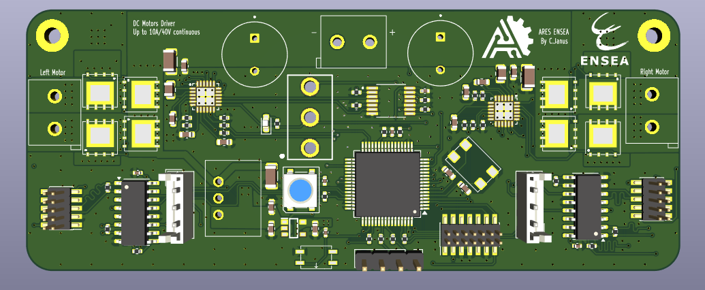
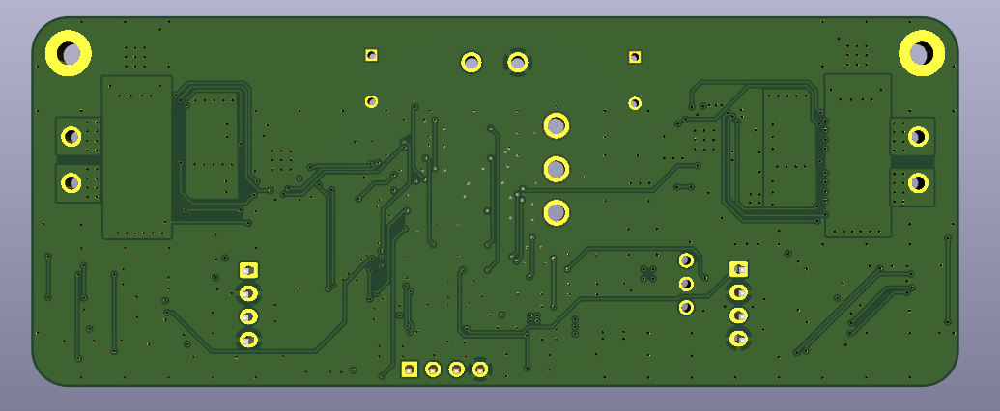

# Driver DRV8701 – Double pont H 40 V / 10 A (15 A crête)

> PCB conçu sous **KiCad** pour le pilotage de **deux moteurs à courant continu** (brushed) jusqu’à 40 V / 10 A.  
> Chaque canal est basé sur un driver TI **DRV8701** associé à quatre MOSFETs de puissance **TPH1R403NL**.  
> Le PCB intègre la **mesure d’encodeur** pour un contrôle en PID et un **asservissement en courant** géré par le DRV8701.  
> La limitation est réglée à **3 A** : au-delà, le driver applique une **régulation par hachage PWM (“current chopping”)** afin de maintenir le courant sous la valeur de consigne.

---

## Caractéristiques principales

| Paramètre                  | Valeur                                               |
| -------------------------- | ---------------------------------------------------- |
| Tension d’alimentation VM  | 7 – 40 V                                             |
| Courant continu par moteur | 10 A (PCB 4 couches, cuivre 1 oz)                    |
| Courant crête              | 15 A (≤ 100 ms)                                      |
| Limite de courant haché    | 3 A (via DRV8701)                                    |
| Topologie                  | 2 × pont H complet (DRV8701 + 4 MOSFETs chacun)      |
| Commande                   | PH / EN / nSLEEP (TTL 3,3 V / 5 V)                   |
| Indications LED            | **EN** (actif quand nSLEEP = HIGH)                   |
| Indications NeoPixel       | État batterie (>25 V / entre 23–25 V / <23 V)        |
| Dimensions PCB             | 100 mm × 40 mm                                       |

---

### Dissipation thermique  
- **Exposed pad** du DRV8701 relié au plan GND via des vias thermiques.  
- MOSFETs **TPH1R403NL (SOP-Advance)** soudés sur un large plan de cuivre et reliés à un plan interne pour conduire plus de courant.  
- Condensateurs de découplage bulk : **470 µF / 50 V** faible ESR.  

---

## Vues du PCB

### Face composants

### Face cuivre arrière

