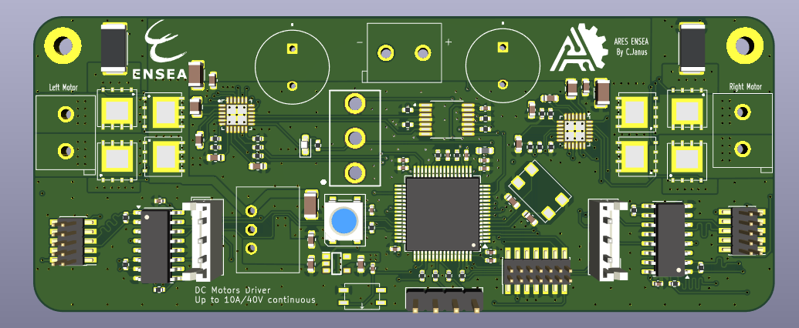
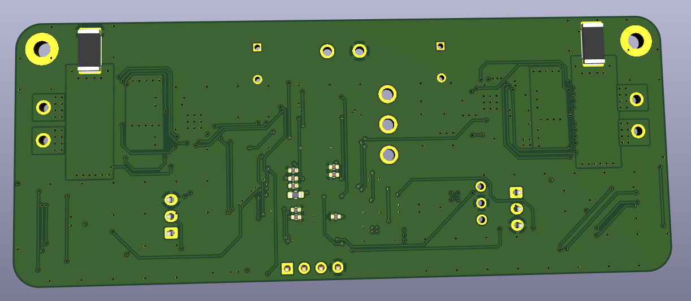

# Driver DRV8701 – Double pont H 40 V / 10 A (15 A crête)

> PCB conçu sous **KiCad** pour le pilotage de **deux moteurs à courant continu** (brushed) jusqu’à 40 V / 10 A.
> Chaque canal utilise un driver TI **DRV8701** associé à quatre MOSFETs de puissance **TPH1R403NL**.
> Le PCB intègre la **mesure d’encodeur**, permettant un contrôle PID, ainsi qu’un **asservissement en courant** géré directement par le DRV8701.
> La limitation est réglée à **3 A** : au-delà, le driver applique une **régulation par hachage PWM (“current chopping”)** pour maintenir le courant sous la consigne.

---

## ⭐ Sponsor : PCBWay

Ce projet a été **sponsorisé par PCBWay**, qui a généreusement fourni les PCB pour le prototypage.
La qualité du PCB est excellente et le support très réactif.

👉 **Lien vers PCBWay :** 

Merci encore à Liam et à l’équipe PCBWay pour leur aide !

---

## Caractéristiques principales

| Paramètre                  | Valeur                                          |
| -------------------------- | ----------------------------------------------- |
| Tension d’alimentation VM  | 7 – 40 V                                        |
| Courant continu par moteur | 10 A (PCB 4 couches, cuivre 1 oz)               |
| Courant crête              | 15 A (≤ 100 ms)                                 |
| Limite de courant haché    | 3 A (via DRV8701)                               |
| Topologie                  | 2 × pont H complet (DRV8701 + 4 MOSFETs chacun) |
| Commande                   | PH / EN / nSLEEP (TTL 3,3 V / 5 V)              |
| Indication LED             | **EN** (active lorsque nSLEEP = HIGH)           |
| Indication NeoPixel        | État batterie (>25 V / 23–25 V / <23 V)         |
| Dimensions PCB             | 100 mm × 40 mm                                  |

---

## Dissipation thermique

* **Exposed pad** du DRV8701 relié au plan GND via vias thermiques.
* MOSFETs **TPH1R403NL (SOP-Advance)** soudés sur large plan de cuivre + plan interne pour la dissipation.
* Condensateurs de découplage bulk : **470 µF / 50 V**, faible ESR.

---

## Vues du PCB

### Face composants

### Face cuivre arrière

---

Voici **la version anglaise**, structurée **exactement comme ton README français**, avec le même style, les mêmes sections et le même badge.

---

# Driver DRV8701 – Dual H-Bridge 40 V / 10 A (15 A peak)

> PCB designed with **KiCad** for driving **two brushed DC motors** up to 40 V / 10 A.
> Each channel uses a TI **DRV8701** driver paired with four **TPH1R403NL** power MOSFETs.
> The board integrates **encoder feedback** for PID control, as well as **current regulation** handled directly by the DRV8701.
> The current limit is set to **3 A**: above this value, the driver applies **PWM current chopping** to maintain the current below the set point.

---

## ⭐ Sponsor: PCBWay

This project was **sponsored by PCBWay**, who kindly provided the PCBs for prototyping.
The PCB quality is excellent and the support very responsive.

👉 **PCBWay Link:**

Thanks again to Liam and the PCBWay team for their support!

---

## Main Specifications

| Parameter                | Value                                        |
| ------------------------ | -------------------------------------------- |
| Supply voltage VM        | 7 – 40 V                                     |
| Continuous current/motor | 10 A (4-layer PCB, 1 oz copper)              |
| Peak current             | 15 A (≤ 100 ms)                              |
| Chopped current limit    | 3 A (via DRV8701)                            |
| Topology                 | 2 × full H-bridge (DRV8701 + 4 MOSFETs each) |
| Control signals          | PH / EN / nSLEEP (TTL 3.3 V / 5 V)           |
| LED indication           | **EN** (active when nSLEEP = HIGH)           |
| NeoPixel indication      | Battery status (>25 V / 23–25 V / <23 V)     |
| PCB dimensions           | 100 mm × 40 mm                               |

---

## Thermal Management

* DRV8701 **exposed pad** connected to the GND plane through thermal vias.
* **TPH1R403NL (SOP-Advance)** MOSFETs soldered onto a large copper area + internal plane for heat spreading.
* Bulk decoupling capacitors: **470 µF / 50 V**, low ESR.

---

## PCB Views

### Component side

### Bottom copper side

