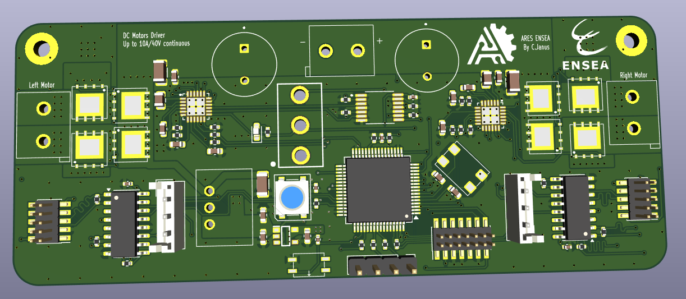

# Driver DRV8701 – Double pont H 40 V / 15 A (20 A crête)

> PCB KiCad conçu pour piloter **deux moteurs à courant continu** (brushed) jusqu’à 40 V.  
> Deux canaux indépendants basés sur le driver TI **DRV8701** et des MOSFETs de puissance **TPH1R403NL**.

---

## Caractéristiques principales

| Paramètre                     | Valeur                                             |
| ----------------------------- | -------------------------------------------------- |
| Tension d’alimentation (VM)   | 7 – 40 V (45 V max absolu)                         |
| Courant continu par moteur    | 15 A (PCB 2 oz, 2 couches)                         |
| Courant crête (≤ 100 ms)      | 20 A                                               |
| Topologie                     | 2 × pont H complet (DRV8701 + 4 MOSFETs chacun)    |
| Commande                      | PH / EN / nSLEEP (3,3 V / 5 V, niveau TTL)         |
| Limitation de courant         | Shunt 5 mΩ + comparateur interne DRV8701           |
| Protections                   | OCP, OTP, UVLO, shoot-through, nFAULT              |
| Indications LED               | **PWR** (alimentation) • **EN** (nSLEEP = HIGH)    |
| Dimensions PCB                | 54 mm × 55 mm                                      |

---

## Implémentation matérielle

### Alimentation logique 3,3 V  
Le DRV8701 requiert **DVDD = 2,7 – 5,5 V**.  
Une **diode Zener 3 V3 + résistance** fournit localement ≈ 3 V (suffisant pour nSLEEP).

### Dissipation  
* Exposed-pad du DRV8701 raccordé au plan GND via vias thermiques.  
* MOSFETs TPH1R403NL (SOP-Advance) soudés sur large cuivre + plan interne.  
* Condos bulk : 470 µF / 50 V faible ESR + céramiques 100 nF proches des MOSFETs.

---

## Vues du PCB

### Face composants

### Face cuivre arrière

